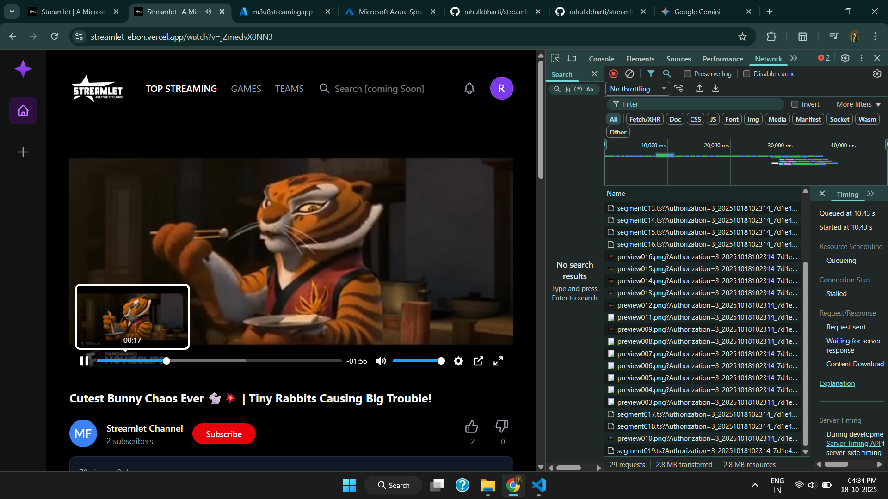
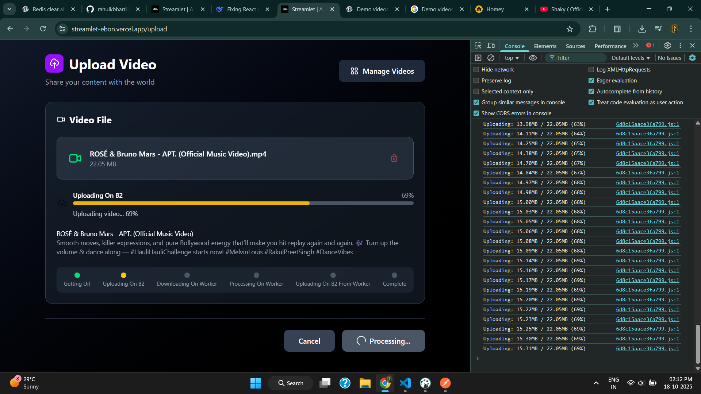

# Streamlet Frontend

The official frontend for the **Streamlet** video streaming platform, built with [Next.js](https://nextjs.org/), [TypeScript](https://www.typescriptlang.org/), and [Tailwind CSS](https://tailwindcss.com/). This client delivers a modern, responsive interface for uploading, browsing, and watching videos.

### Outputs :

<table>
   <tr>
      <td>
         
      </td>
      <td>
         
      </td>
   </tr>
</table>

---

## 🚀 Features

- **Modern UI:** Responsive design with Tailwind CSS and Radix UI for accessibility and aesthetics.
- **Video Uploads:** Seamless uploads with real-time progress via Socket.io.
- **Adaptive Playback:** High-quality streaming using HLS.js and a customizable Plyr-React player.
- **State Management:** Centralized state with Redux Toolkit and Redux Persist.
- **Optimized Data Fetching:** Fast, reliable data with TanStack Query.
- **Robust Forms:** Built with Formik for flexible form handling.

---

## 🛠️ Technology Stack

| Purpose           | Tech/Library                 |
| ----------------- | ---------------------------- |
| Framework         | Next.js                      |
| Language          | TypeScript                   |
| Styling           | Tailwind CSS                 |
| UI Components     | Radix UI, Lucide React       |
| State Management  | Redux Toolkit, Redux Persist |
| Data Fetching     | TanStack Query               |
| Video Playback    | HLS.js, Plyr-React           |
| Forms             | Formik                       |
| API Communication | Axios, Socket.io Client      |

---

## 🗄️ Backend Service

This is a client-only application. For full functionality, ensure the backend services are running.  
👉 **[Streamlet Backend Repository](https://github.com/rahulkbharti)** _(https://github.com/rahulkbharti/streamlet-microservices.git)_

---

## 🏁 Getting Started

1. **Clone the repository:**

   ```bash
   git clone https://github.com/rahulkbharti/streamlet-frontend.git
   cd streamlet-frontend
   ```

2. **Install dependencies:**

   ```bash
   npm install
   ```

3. **Configure environment variables:**

   - Create a `.env.local` file in the project root:
     ```
     NEXT_PUBLIC_API_URL=http://localhost:8000
     NEXT_PUBLIC_CONTENT_URL=http://localhost:8001
     ```

4. **Run the development server:**

   ```bash
   npm run dev
   ```

5. **Open** [http://localhost:3000](http://localhost:3000) **in your browser.**

---

## 📄 License

Distributed under the MIT License. See [LICENSE](./LICENSE) for details.

---

## 🤝 Contributing

Contributions are welcome! Please open issues or submit pull requests for improvements.

---

## 📫 Contact

For questions or support, open an issue or contact the maintainers.
